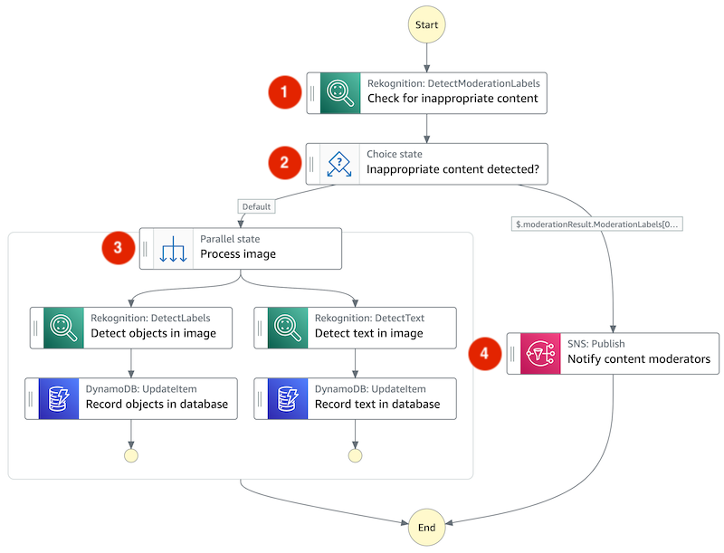

## Serverless Image Catalog

Photo sharing websites often allow users to publish user-generated content such as text, images, or videos. Manual content review and categorization can be challenging. This solution enables the automation of these tasks. See the AWS Blog post [Building a serverless image catalog with AWS Step Functions Workflow Studio](https://aws.amazon.com/blogs/compute/building-a-serverless-image-catalog-with-aws-step-functions-workflow-studio/) for a detailed walkthrough.



The example implements the following workflow:

1. An image stored in [Amazon S3](https://aws.amazon.com/s3/) is checked for inappropriate content using the [Amazon Rekognition](https://aws.amazon.com/rekognition/) `DetectModerationLabels` API.
2. Based on the result of (1), appropriate images are forwarded to image processing while inappropriate ones trigger an email notification.
3. Appropriate images undergo two processing steps in parallel: the detection of objects and text in the image via Amazon Rekognition’s `DetectLabels` and `DetectText` APIs. The results of both processing steps are saved in an [Amazon DynamoDB](https://aws.amazon.com/dynamodb/) table.
4. An inappropriate image triggers an email notification for manual content moderation via the [Amazon Simple Notification Service (SNS)](https://aws.amazon.com/sns/).

This repository contains two AWS Serverless Application Model (AWS SAM) templates:

1. `starter/template.yml` intended as the starting point for following the walkthrough in the AWS Compute Blog post [Building a serverless image catalog with AWS Step Functions Workflow Studio](https://aws.amazon.com/blogs/compute/building-a-serverless-image-catalog-with-aws-step-functions-workflow-studio/).
2. `solution/template.yml`for deploying the completed serverless image catalog solution.

## Prerequisites

- An [AWS account](https://aws.amazon.com/premiumsupport/knowledge-center/create-and-activate-aws-account/)
- An AWS user with `AdministratorAccess` (see the [instructions](https://console.aws.amazon.com/iam/home#/roles%24new?step=review&commonUseCase=EC2%2BEC2&selectedUseCase=EC2&policies=arn:aws:iam::aws:policy%2FAdministratorAccess) on the [AWS Identity and Access Management (IAM)](http://aws.amazon.com/iam) console)
- AWS SAM CLI using the instructions [here](https://docs.aws.amazon.com/serverless-application-model/latest/developerguide/serverless-sam-cli-install.html)

## Deploy using SAM

### Step 1: Clone repository

```bash
git clone git@ssh.gitlab.aws.dev:pbv/serverless-image-catalog.git
```

### Step 2: Build the template

```bash
cd serverless-image-catalog/solution
sam build
```

### Step 3: Deploy the application

```bash
sam deploy --guided
```

## Security

See [CONTRIBUTING](CONTRIBUTING.md#security-issue-notifications) for more information.

## License

This library is licensed under the MIT-0 License. See the LICENSE file.
